# IOFMaterialsTutorial

Tutorial for using Mat-O-Lab tools in conjunction with the [IOF ontologyies](https://github.com/iofoundry/ontology) to create sematic data for material science eated characterisaton methods.
 
Please notice that this tutorial is using unconfirmed experimental parts of the ontology stack like the [IOF qualities](https://github.com/iofoundry/ontology/blob/'qualities'/qualities/qualities.rdf) and the [IOF materials ontology](https://github.com/iofoundry/ontology/blob/materials/materials/Materials.rdf). This also includes some modelling strategies for including [QUDT](https://qudt.org/) concepts which are not officially accepted.

# Table of Contents
- [IOFMaterialsTutorial](#iofmaterialstutorial)
- [Table of Contents](#table-of-contents)
- [Basic Tutorial](#basic-tutorial)
  - [Introduction DrawIO and Chowlk](#introduction-drawio-and-chowlk)
  - [Data Conversion](#data-conversion)
  - [Create a Mapping](#create-a-mapping)
  - [Apply Mapping](#apply-mapping)
  - [Load Data](#load-data)
  - [Query Data](#query-data)
- [Advanced Example](#advanced-example)
  - [Creating the Method Graph](#creating-the-method-graph)
  - [Data Conversion](#data-conversion-1)
  - [Create the Mapping](#create-the-mapping)
  - [Run the mapping](#run-the-mapping)
- [More Examples](#more-examples)
  - [Hardness Measurements](#hardness-measurements)
  - [Image Analysis](#image-analysis)

# Basic Tutorial

## Introduction DrawIO and Chowlk
 - Start DrawIO Session [ClickME](https://app.diagrams.net/)
 - Create a new Blank Diagram and give it a name 
  ```
  LenghtMeasurement.drawio.xml
  ```
  
 
 - Install IOF Materials ScratchPad from
  ```
  https://github.com/Mat-O-Lab/IOFMaterialsTutorial/raw/main/IOFMaterialsScatchpad.xml
  ```
  by clicking Open Library from/URL
  
 - Create a Simple Graph: Measurement of the Length of a Object by using Scratchpad Elements.
   - First add the Prefix and the Provenance Boxes. Make Changes to the template value.
  
  Therefor change the labels in the double Boxes to ur Needs. The upper Box is used for the rdf:type definition of the named Individual. The lower Box label ist the Name of the Individual. It Must be unique i the graph and should be a human understandable name in the context of the graph. 
   - Add the MeaurementProcess Block from the Scatchpad to ur Graph
  
  Change the Type Definitions: \
  iof:MeasurementCapability -> iof-mat:DistanceMeasurementCapability \
  iof:Quality -> iof-qual:Length \
  Also change all the Labels of the lower boxes.
   - A complete example can be found [here](https://raw.githubusercontent.com/Mat-O-Lab/IOFMaterialsTutorial/main/LenghtMeasurement.drawio.xml)
  
 - conversion to RDF with [Chowlk](https://chowlk.linkeddata.es/)
    - upload your drawio xml file
    
    - download the result or react to the protocoled warnings or errors
    
    - A complete example can be found [here](https://raw.githubusercontent.com/Mat-O-Lab/IOFMaterialsTutorial/main/LenghtMeasurement.ttl)
## Data Conversion
A simple Measurements Table
- Create CSV Table with Length consecutive Measurements of the Objects Length, see for [example](measurements.csv).
- Conversion of Table to RDF with [CSVToCSVW](https://csvtocsvw.matolab.org/)
  - upload csv file or better use a web location of ur csvfile, so it can be resolved through the meta data generated
  ```
  https://raw.githubusercontent.com/Mat-O-Lab/IOFMaterialsTutorial/main/measurements.csv
  ```


  - download csvw meta data

  - example output can be found [here](https://raw.githubusercontent.com/Mat-O-Lab/IOFMaterialsTutorial/main/measurements-metadata.json)
## Create a Mapping
Create a Mapping of Graph to Data Table with [MapToMethod](https://maptomethod.matolab.org/)
- Upload your measurements meta data file to a publicly available web location or use the example url
  ```
  https://raw.githubusercontent.com/Mat-O-Lab/IOFMaterialsTutorial/main/measurements-metadata.json
  ```

- visit and paste above url to the URL META DATA Field and the location of ur Measurement Graph Turtle File to the URL METHOD GRAPH FIELD
  ```
  https://github.com/Mat-O-Lab/IOFMaterialsTutorial/raw/main/LengthMeasurement.ttl
  ```
    
    and click on Start Mapping
- in the new form pick from the dropdown the column in ur measurement data file that u want to map to your method graph

and click Create Mapping
- download the create rulebases Yarrml mapping

- example output can be found [here](https://raw.githubusercontent.com/Mat-O-Lab/IOFMaterialsTutorial/main/measurements-map.yaml)
  
## Apply Mapping
Use the Mapping with [RDFConverter](https://rdfconverter.matolab.org/)
- Upload your mapping file to a publicly available web location or use the example url
  ```
  https://raw.githubusercontent.com/Mat-O-Lab/IOFMaterialsTutorial/main/measurements-map.yaml
  ```
- visit and paste above url to the URL Field Mapping
  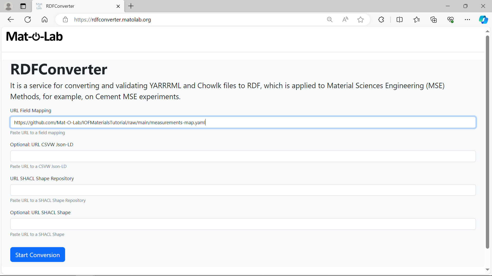
    and click on Start Mapping
- a joined graph will be created and is available for download
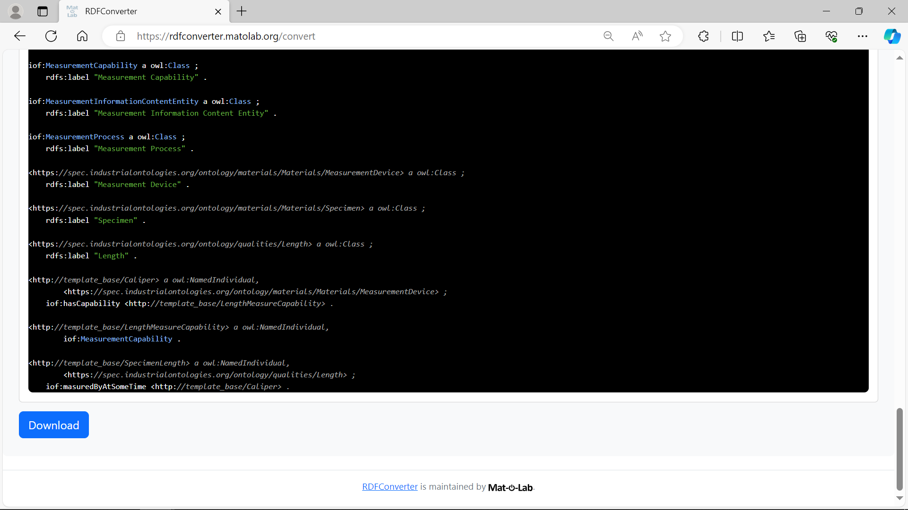
and download the graph.
- example output can be found [here](https://raw.githubusercontent.com/Mat-O-Lab/IOFMaterialsTutorial/main/measurements-joined.ttl)
## Load Data
Load Data to Triplestore
## Query Data
Sample Querys on Create Graph

# Advanced Example
This example uses the [open-access Additive Manufacturing Materials Database](https://ammd.nist.gov/query-ontology/) (AMMD) of [NIST](https://www.nist.gov/), that is a collaborative platform that shares structured material data with the AM community, advancing the development of AM technology.

The original data can be obtained at https://ammd.nist.gov/query-ontology/ AMTests/Powder/ParticleSize/Sieving

in particular:

- NIST_IN625_RR_WesternIllinoisPSS2.xml
- Project ID: NIST-IN625-RR-14
- Material Name: IN625
- MaterialStockID: NIST_IN625_RR_Feedstock_WesternIllinois
- Test Standards: ASTM B214-07
- Test Type: particle size sieving
- Test preparation: Virgin Powder in Dispenser
- Test Results:
  - Particle Size
  - percentOfMass

The data is result of a powder sieving analysis according to ASTM B214-22. 
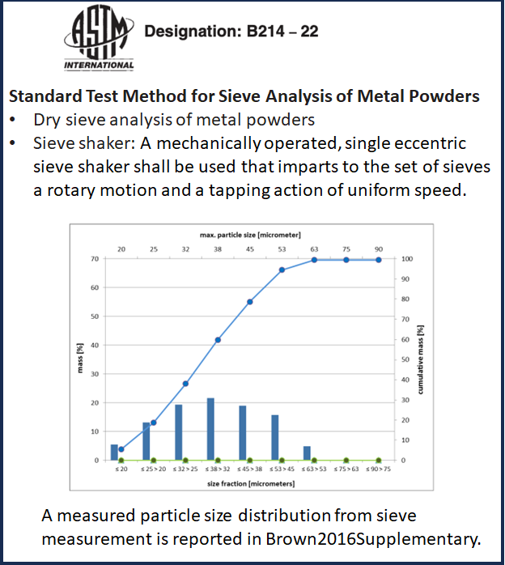
  

The data is downloaded through the implemented REST API reorganised and saved as [csv](https://github.com/Mat-O-Lab/IOFMaterialsTutorial/blob/main/sieveDistribution-AMMD.csv).
To use the implemented lookup of the CSVToCSVW tool, the unit symbols are added the header labels as an be seen in the [adjusted csv](https://github.com/Mat-O-Lab/IOFMaterialsTutorial/blob/main/sieveDistribution-AMMD_adjusted.csv).

## Creating the Method Graph

Open the DrawIO Application and the IOFTutorial Scatchpad as described in the [Introduction to DrawIO and Chowlk](#introduction-drawio-and-chowlk).

Add the provenance information by dragging out the particulare boxes fram the Scratchpad and make the changes needed.
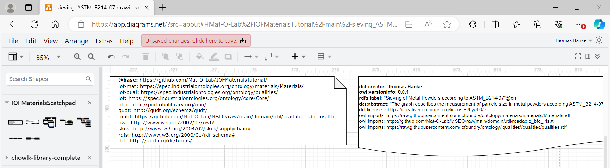

Our method is conducted according to the standard ASTM B214-22 o we should point out this fact.
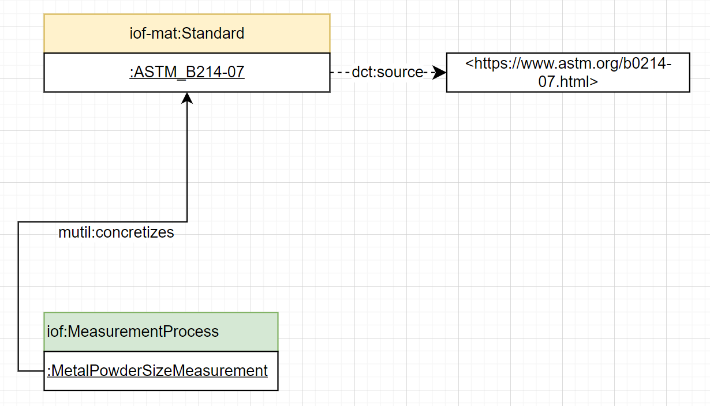

The specimen here is a portion of metal powder taken from a feedstock. Both have an Identifier in the data so lets model these too.
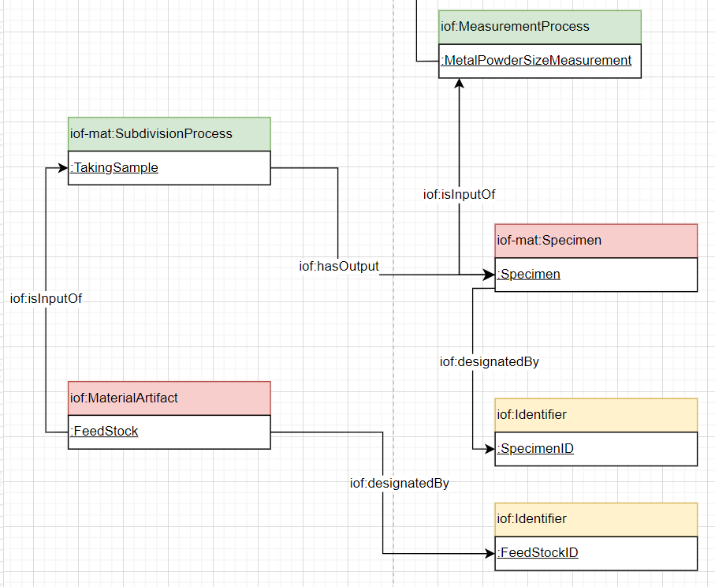

The powder taken is sieved and the mean size of the particles passing the sieve can be calculated according to the standard. The mass of the particles in elation to the overall mass is calculated using the measured mass by a balance. So the assemply of particles passing the sieve as to qualities we refer to.
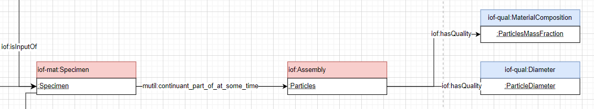

We need to measurement devices the sieve and the belance whch are used in two consecutively measurementprocesses in there there measurement capabilities are realized. 
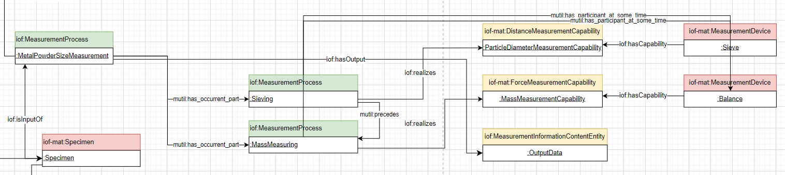
The whole measurement process has the measurement data as an output.

The data is about the qualities of the particles assembly and we need to draw a connection which device is used to measure the particular quality.
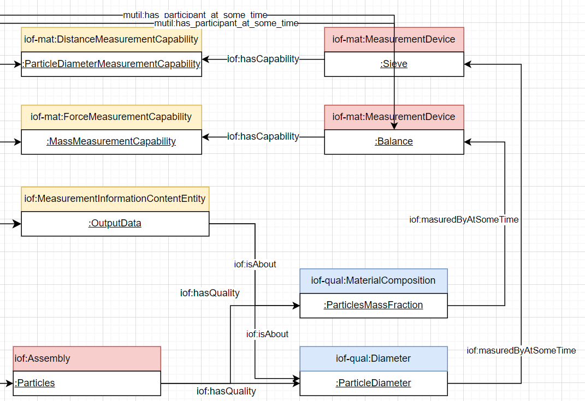
Our method graph is done.

## Data Conversion

Just as in the basic tutorial the URL of the csv file is passed to the [CSVToCSVW](https://csvtocsvw.matolab.org/)
tool.
```
https://raw.githubusercontent.com/Mat-O-Lab/IOFMaterialsTutorial/main/sieveDistribution-AMMD_adjusted.csv
```
The resulting meta data file can be found here [csv-metadata.json](https://github.com/Mat-O-Lab/IOFMaterialsTutorial/blob/main/sieveDistribution-AMMD_adjusted-metadata.json).

In our Data every row of the table seams to offer data for an sieving experiment each. Thats why we will need every data cel in the data for the creation of the sematic data. Because of that we will serialize the whole table as sematic data using the [rdf api endpoint](https://csvtocsvw.matolab.org/api/docs#/default/rdf_api_rdf_post) of the CSVToCSVW tool.

We need to pass the location of our csv meta data.
```
https://github.com/Mat-O-Lab/IOFMaterialsTutorial/raw/main/sieveDistribution-AMMD_adjusted-metadata.json
```
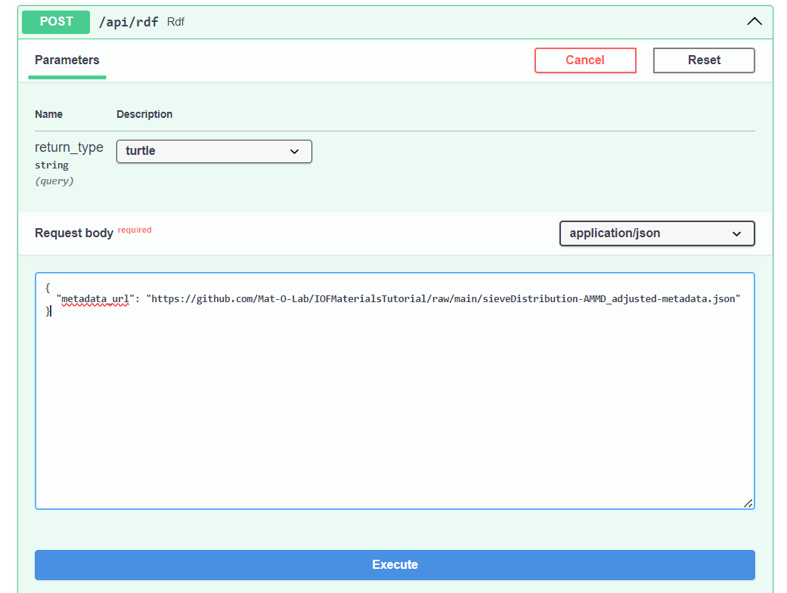
After excecuting the results can be downloaded. 
The semantic table data can be found [here](https://github.com/Mat-O-Lab/IOFMaterialsTutorial/blob/main/sieveDistribution-AMMD_adjusted.ttl).

## Create the Mapping
Go through the steps described in [Create a Mapping](#create-a-mapping).
This time we need make some manual changes to the mapping rules which can not be done through the MapToMethod UI.

First we set a flag that this mapping will be done for every single row of the table so that it wil result in a method graph for each of them.
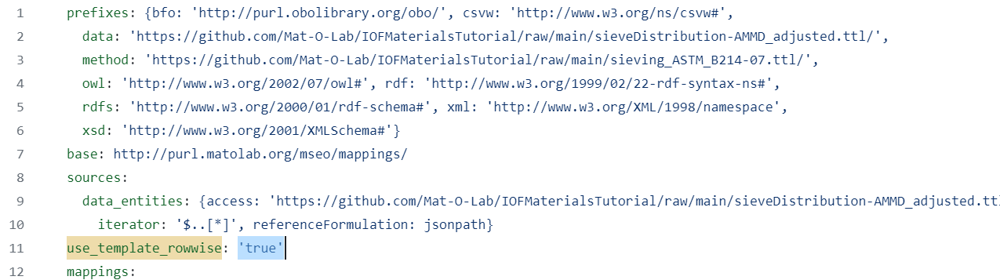

Second we add two rules for the identifiers of specimen and feedstock which they are taken from.
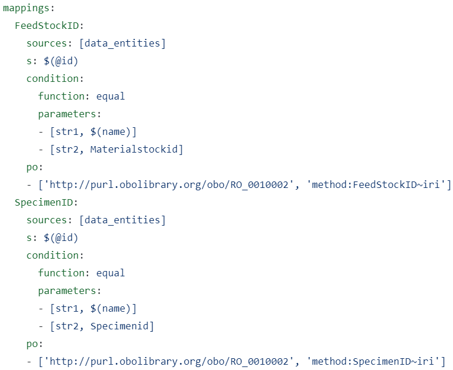

Next we add the whole csvw:TableGroup instance as the OutputData.
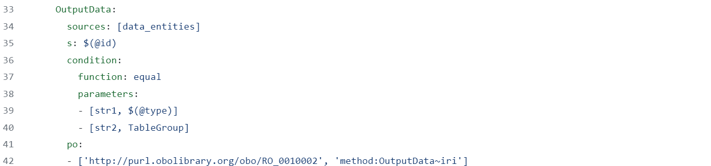

And at last we add the mapping rules for the measurement columns using the predicate iof:isMeasuredValueOfAtSomeTime.
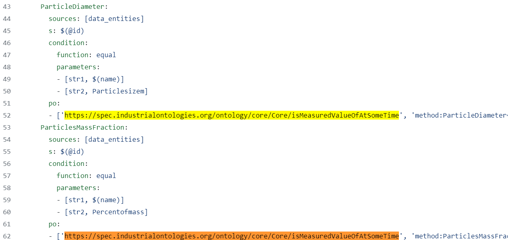

The resulting mapping file can be found [here](https://github.com/Mat-O-Lab/IOFMaterialsTutorial/blob/main/sieveDistribution-map.yaml).

## Run the Mapping
Run the mapping like explained in  [Appy Mapping](#apply-mapping), no further changes needed.
```
https://raw.githubusercontent.com/Mat-O-Lab/IOFMaterialsTutorial/main/sieveDistribution-map.yaml
```

This results in a joined graph with replicas of our method graph and mapped data for each row of our table. The example result can also be found [here](https://github.com/Mat-O-Lab/IOFMaterialsTutorial/blob/main/sieveDistribution-joined.ttl)

For better readability a prefix for every row index of the table is created.

# More Examples

## Hardness Measurements
Using [HardnessGraph](https://gitlab.com/kupferdigital/process-graphs/vickers-hardness-test-fem)


## Image Analysis
Example using an OMERO Image Server, see doucmentation in this [Repo](https://github.com/BAMresearch/DF-TEM-PAW/tree/main).
