# IOFMaterialsTutorial

# Table of Contents
- [IOFMaterialsTutorial](#iofmaterialstutorial)
- [Table of Contents](#table-of-contents)
- [Basic Tutorial](#basic-tutorial)
  - [Introduction DrawIO and Chowlk](#introduction-drawio-and-chowlk)
  - [Data Conversion](#data-conversion)
  - [Create a Mappings](#create-a-mappings)
  - [Apply Mapping](#apply-mapping)
  - [Load Data](#load-data)
  - [Query Data](#query-data)
- [Advanced Examples](#advanced-examples)
  - [Hardness Measurements](#hardness-measurements)
  - [Image Analysis](#image-analysis)

# Basic Tutorial

## Introduction DrawIO and Chowlk
 - Start DrawIO Session [ClickME](https://app.diagrams.net/)
 - Create a new Blank Diagram and give it a name 
  ```
  LenghtMeasurement.drawio.xml
  ```
  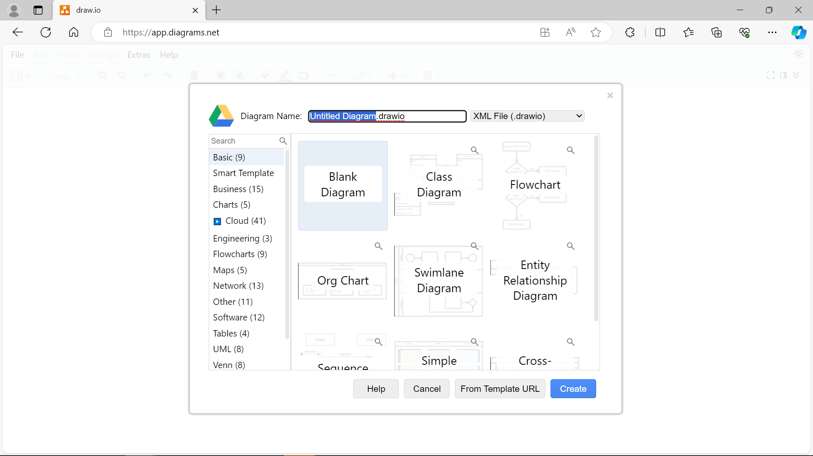
 
 - Install IOF Materials ScratchPad from
  ```
  https://github.com/Mat-O-Lab/IOFMaterialsTutorial/raw/main/IOFMaterialsScatchpad.xml
  ```
  by clicking Open Library from/URL
  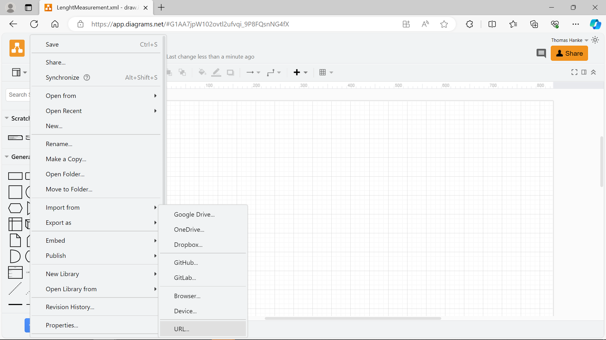
 - Create a Simple Graph: Measurement of the Length of a Object by using Scratchpad Elements.
   - First add the Prefix and the Provenance Boxes. Make Changes to the template value.
  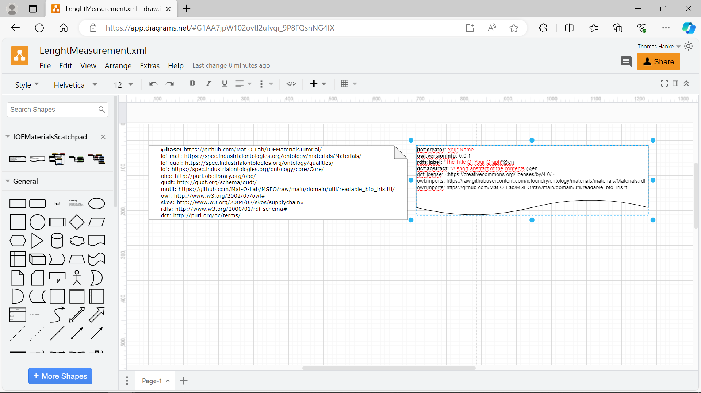
  Therefor change the labels in the double Boxes to ur Needs. The upper Box is used for the rdf:type definition of the named Individual. The lower Box label ist the Name of the Individual. It Must be unique i the graph and should be a human understandable name in the context of the graph. 
   - Add the MeaurementProcess Block from the Scatchpad to ur Graph
  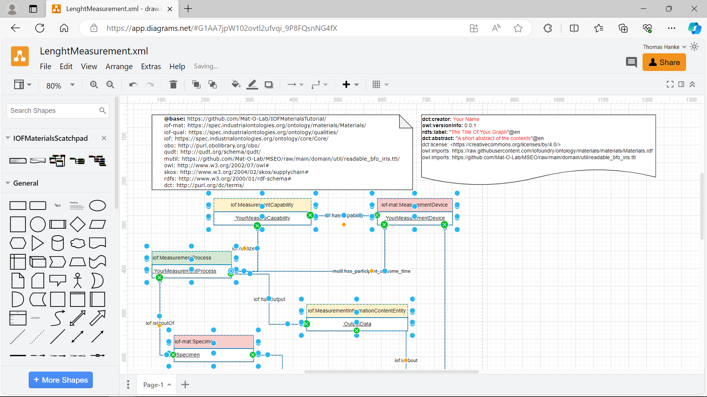
  Change the Type Definitions: \
  iof:MeasurementCapability -> iof-mat:DistanceMeasurementCapability \
  iof:Quality -> iof-qual:Length \
  Also change all the Labels of the lower boxes.
   - A complete example can be found [here](https://raw.githubusercontent.com/Mat-O-Lab/IOFMaterialsTutorial/main/LenghtMeasurement.drawio.xml)
  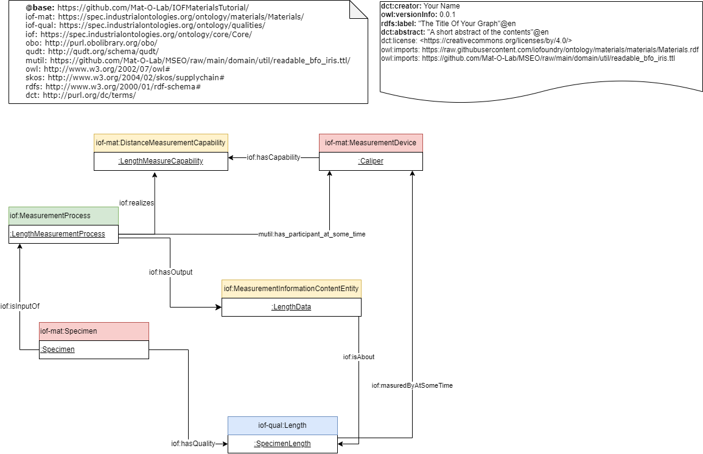
 - conversion to RDF with [Chowlk](https://chowlk.linkeddata.es/)
    - upload your drawio xml file
    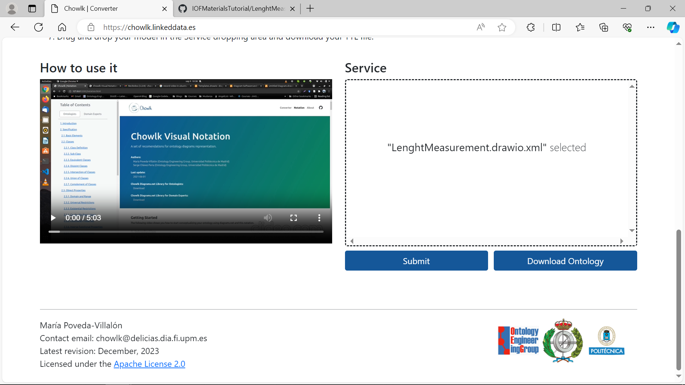
    - download the result or react to the protocoled warnings or errors
    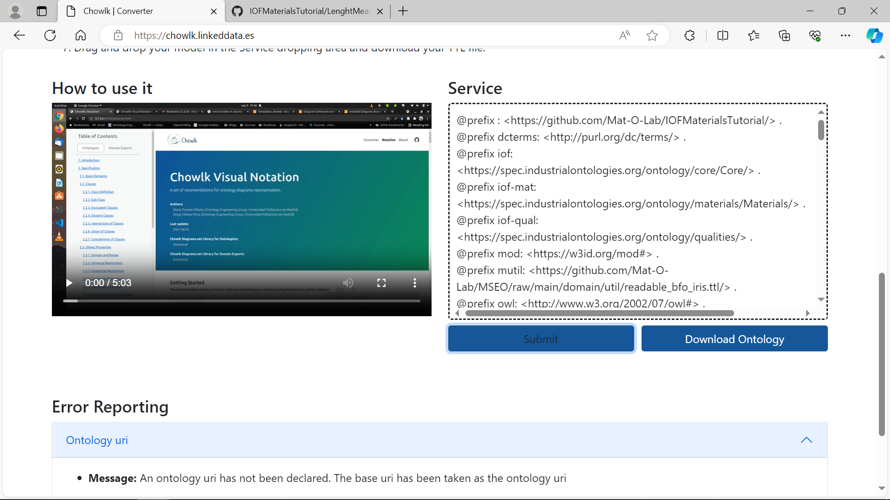
    - A complete example can be found [here](https://raw.githubusercontent.com/Mat-O-Lab/IOFMaterialsTutorial/main/LenghtMeasurement.ttl)
## Data Conversion
A simple Measurements Table
- Create CSV Table with Length consecutive Measurements of the Objects Length, see for [example](measurements.csv).
- Conversion of Table to RDF with [CSVToCSVW](https://csvtocsvw.matolab.org/)
  - upload csv file
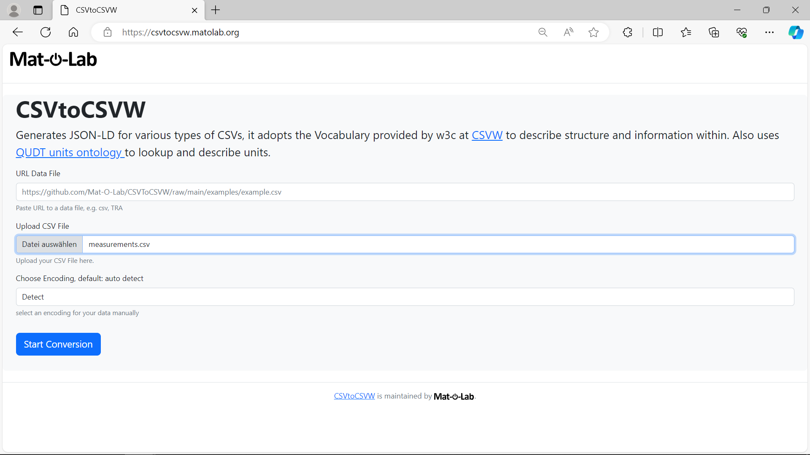
  - download csvw meta data
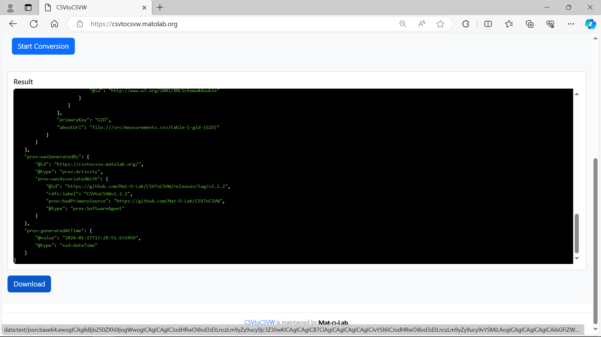
  - example output can be found [here](https://raw.githubusercontent.com/Mat-O-Lab/IOFMaterialsTutorial/main/measurements-metadata.json)
## Create a Mappings
Create a Mapping of Graph to Data Table with [MapToMethod](https://maptomethod.matolab.org/)
- Upload your measurements meta data file to a publicly available web location or use the example url
  ```
  https://raw.githubusercontent.com/Mat-O-Lab/IOFMaterialsTutorial/main/measurements-metadata.json
  ```

- visit and paste above url to the URL META DATA Field and the location of ur Measurement Graph Turtle File to the URL METHOD GRAPH FIELD
  ```
  https://github.com/Mat-O-Lab/IOFMaterialsTutorial/raw/main/LengthMeasurement.ttl
  ```
    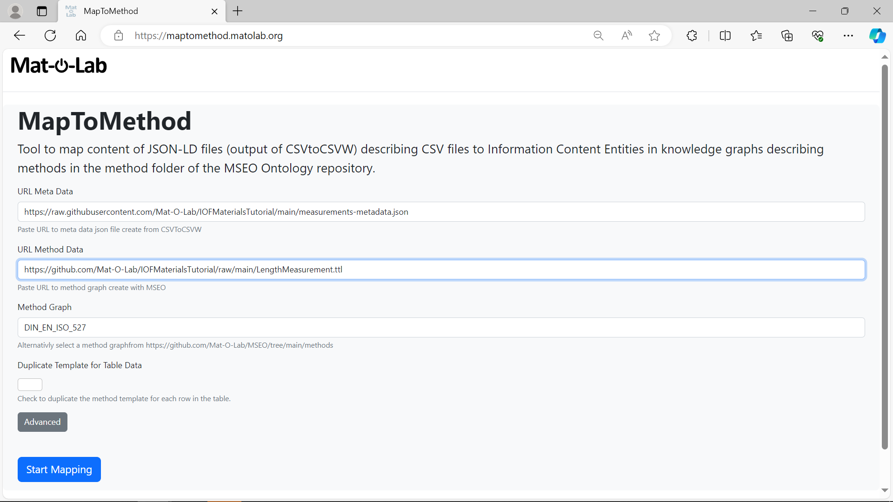
    and click on Start Mapping
- in the new form pick from the dropdown the column in ur measurement data file that u want to map to your method graph
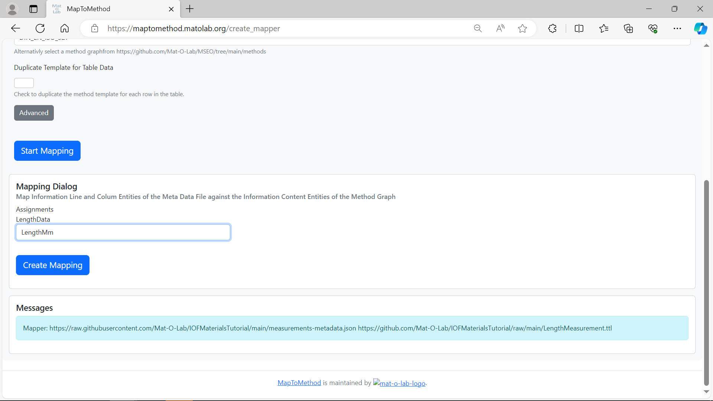
and click Create Mapping
- download the create rulebases Yarrml mapping
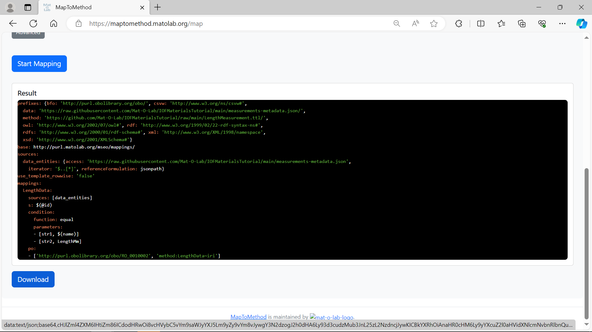
- example output can be found [here](https://raw.githubusercontent.com/Mat-O-Lab/IOFMaterialsTutorial/main/measurements-map.yaml)
  
## Apply Mapping
Apply Mapping to RDF Data
## Load Data
Load Data to Triplestore
## Query Data
Sample Querys on Create Graph

# Advanced Examples
## Hardness Measurements
Using [HardnessGraph](https://gitlab.com/kupferdigital/process-graphs/vickers-hardness-test-fem)
[Image](https://user-content.gitlab-static.net/e8fcc493e7403be54bcd61c1889d9eb8f191ead4/68747470733a2f2f6b75706665726469676974616c2e6769746c61622e696f2f70726f636573732d6772617068732f7669636b6572732d686172646e6573732d746573742d66656d2f7669636b6572732d686172646e6573732d746573742d66656d2e737667)
## Image Analysis
Using this [Repo](https://github.com/BAMresearch/DF-TEM-PAW/tree/main)
